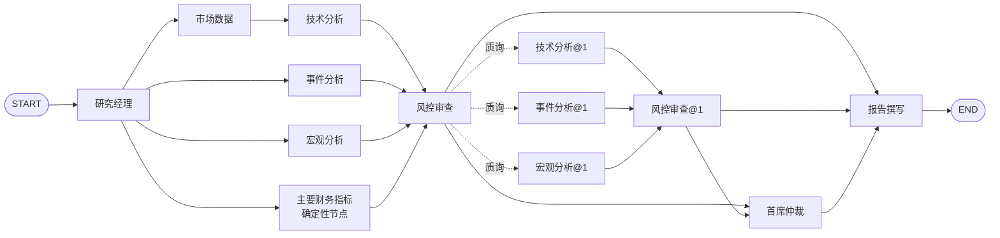

# 架构与实现决策

## 产品范围

系统为本地单用户、A 股/美股日线市场研究系统。前端默认 A 股真实日线，腾讯公共行情无需密钥；模型单独启用。API 省略 market 时保留 US 以兼容旧任务。所有界面、持久化记录、报告都保留数据模式。

条件路由多 Agent 图（八个角色节点，外加一个不调用模型的财务数据节点）：

Manager 制定研究计划，决定可选角色（事件分析、宏观分析）是否启用并记录停用原因；Market 获取标准化日线；Technical 用 Python 计算；News 去重及时间过滤；Macro 解释有限利率背景；Fundamentals（非角色）取回主要财务指标并直接进证据池；Risk 检测跳价、样本不足、动量极端与覆盖缺口，并可质询返工；Arbiter 在方向冲突时裁决；Report 汇总。

**冲突检测是确定性的，不依赖模型**，共两条判据：一是价格趋势与供应商新闻情绪标签方向相反；二是均线排列与 RSI 背离（`trend` 为上行而 RSI14 ≥ 70，或 `trend` 为下行而 RSI14 ≤ 30）。第二条不读新闻，因此 A 股与演示模式下仲裁同样可被触发——中文新闻没有情绪标签，只留第一条的话仲裁在这些配置里永远不会运行。仲裁的裁决措辞按命中的判据种类生成：情绪分歧可以说「以价格为主证据」，均线/RSI 分歧的两边都源自同一段价格序列，只能说当前方向确定性有限。

图中的回边是**有上限的循环**：被质询的角色最多复审一轮，轮次由节点名 `@1` 后缀表达。
系统不做自主工具调用（ReAct）：取数与校验始终是确定性代码，模型只对已校验的数据做推理与判断。
所有节点始终存在于图中，被计划排除的角色节点立即返回 `status: "skipped"` 与原因，不执行取数或模型调用——这是为了避免 `[technical, news, macro, fundamentals] -> risk` 汇合屏障在动态删边时死锁。动态性由质询回边提供；研究范围与取数清单仍由请求参数和计划决定。

## 通信与持久化

- LangGraph `StateGraph` 使用独立状态字段传递各角色输出，避免并发写同一个消息数组。
- `market -> technical` 是依赖链，`[technical, news, macro, fundamentals] -> risk` 为显式汇合屏障。
- `risk` / `risk@1` 使用条件边：有质询时路由到对应 `@1` 返工节点，检测到方向冲突时路由到 `arbiter`，否则进入 `report`。返工节点回到 `risk@1`，构成上限一轮的环。
- `research_jobs` 保存请求、状态、租约、执行次数、调用预算。
- `agent_runs` 以 `(job_id, name)` 为主键保存节点状态、结果和时间。
- `research_events` 保存状态事件；`model_calls` 保存调用预留与成功用量。
- 标准化行情、新闻、宏观与证据快照保存在 JSON 输出内，规模最多 300 条日线/12 条新闻。

**本版本采用应用层持久化节点结果，不是 LangGraph 原生 checkpointer。** 进程恢复后重新进入同一张图，包装器按 `(job_id, name)` 读取已完成节点并跳过外部调用，复用同一请求的数据。运行到一半的节点会重新执行；外部服务仍属于至少一次执行，不能承诺网络请求严格只发生一次。模型调用先持久化预留预算，可以限制中断后的重复计费风险。

## 任务生命周期

`queued -> running -> completed | partial | failed | cancelled`

API 创建任务后立即返回 202。Worker 通过条件 UPDATE 原子领取，获得唯一 owner token 和 60 秒租约。每 20 秒续约。节点写入必须满足当前 owner、running 状态和未过期租约，阻止旧 Worker 覆盖新结果。失效租约可被重新领取，最多恢复 3 次。

取消是协作式的：马上变更任务状态并隔离后续结果；已经发往供应商的 HTTP 请求不会被远端撤回，仍可能计费。任务时间预算在节点边界检查，单个在途 HTTP 调用受自身超时控制，不是硬实时进程终止。

本地默认一个嵌入 Worker；Docker 将 API 和 Worker 分离。SQLite 适合本地轻负载，启用 WAL；PostgreSQL 用于部署。数据库中每个节点的输出是本次请求的快照，不实现跨任务共享缓存。

## 失败策略

行情失败：整个任务失败，不编造价格。新闻/宏观 ProviderError：对应节点 partial，保留缺失原因，继续产出受限报告。模型 HTTP、拒绝、输出截断或引用校验失败：不展示其内容，输出规则报告并记录限制。

业务任务不自动重试不可用数据，以避免耗尽 Alpha Vantage 配额。恢复是处理进程中断，不是无限调用上游。模型预算默认每任务 12 次调用，单次输出上限默认 4000 tokens；金额是基于用户配置单价的估算。

## 技术取舍

- FastAPI + SQLAlchemy Core，避免为八个角色拆微服务。
- LangGraph 管理执行关系；LangChain Core 仅用于模型提示模板。
- SQLite 默认便于直接运行，PostgreSQL 使用相同仓储接口。
- Redis 暂不引入；任务已持久化于数据库，不需要额外 Broker。
- Next.js App Router / React / TypeScript；无远程字体依赖，图形用 SVG 实现。
- Markdown 由受控模板生成，对外部文本转义；浏览器用 React 文本渲染，不执行原始 HTML。
- 密钥只在环境配置中。异常消息不回显含 API Key 的供应商 URL。

## 后续可扩展项

优先追加交易所标的元数据与交易日历、CN 复权行情、估值 Agent、真实宏观历史版本。再考虑跨任务缓存、多用户鉴权、PDF 导出和规模化执行。当前不把缺失的这些能力包装成已实现功能。

## 核对过的官方资料

- LangGraph 图与汇合：https://docs.langchain.com/oss/python/langgraph/graph-api
- LangGraph 持久化概念：https://docs.langchain.com/oss/python/langgraph/persistence
- FastAPI 后台任务边界：https://fastapi.tiangolo.com/tutorial/background-tasks/
- Alpha Vantage 数据接口：https://www.alphavantage.co/documentation/
- OpenAI 结构化输出：https://developers.openai.com/api/docs/guides/structured-outputs
- Next.js 安装要求：https://nextjs.org/docs/app/getting-started/installation

## 双市场行情

PublicMarketProvider 负责日线：CN 规范化交易所代码；US 从公开报价元数据解析交易所后缀。价格分析仅使用截止日前已收盘日线。A 股未复权、美股前复权（当前修订版本），币种和口径随结果存储；旧报告显示时兼容 USD。上游错误不回退合成数据。

CN 侧在同一 client 生命周期内多取三样东西，全部与主序列同源同区间：一份前复权对照序列（与未复权序列相减即为除权当日的实测影响，见 `analytics.attribute_actions`）、主序列同一批 `rows` 内嵌的除权公告（第 7 个元素起的字典，因此不必再引第三方公告接口）、新浪财经的第二源日线（`cross_source.cross_check`）。对照序列与主序列日期不一致时整份丢弃，避免把「少了一天」误报成公司行动；交叉校验用相对容差而非等值，且美股比对起点落在最近一次公司行动之后，避免两源复权口径差异被读成数据出错。三项都是可降级的：取不到只写 warning，主序列照常出报告。

CN 成交额（`amount`）依赖会限流的公开接口，本版本不实现该取数，报告中显式声明成交额不可得，而不是用 `volume × 均价` 估算。

新闻与宏观按市场分流：A 股走 `china_news`（东方财富个股新闻与公司公告）和 `china_macro`（东方财富数据中心多项宏观指标），两者都无需密钥，并且都在本地按截止日再过滤一次，不把时点判断完全托给上游的 `filter`；美国沿用 Alpha Vantage 可选适配器。任一路径不可用时由计划明确停用并记录原因，不以虚构数据替代。

## 财务数据：是数据域，不是角色

A 股主要财务指标由确定性节点 `fundamentals` 取回（东方财富数据中心 `RPT_F10_FINANCE_MAINFINADATA`，无需密钥），写入独立状态键并直接进入证据池，报告「证据来源」中 `kind` 为 `fundamental`。**它不进角色花名册**：不出现在 `AGENT_SPECS`、角色列表、计划的 `enabled_agents` / `skipped_reason` 中，也不参与质询返工（`target_agent` 只有 technical / news / macro 三者）。这样做的理由是：财务指标是取数与引用问题，不需要多一轮模型角色，而多 agent 协作的卖点不应被一个纯搬运数据的角色稀释。

时点收口用**公告日** `NOTICE_DATE <= as_of`，不是报告期末：2026 中报的报告期末是 6-30，公告日却是 8-22，按报告期末收口会把 8 月下旬才公开的数据拿去解释 6-7 月的行情，构成前视偏差。上游把未披露项写成 `null` 或 `"--"`，这类值一律保留为未知而不是 0；派生比率（如经营现金流/归母净利）的分子或分母不可用时返回未知。同一报告期被更正时取公告日更晚的一条。美股财报本轮不提供（Alpha Vantage 财务需付费密钥），节点返回 `status: "skipped"` 并写明原因，不用估计值替代。A 股节点本身取数失败降级为 `partial` 加 warning，不让整份报告失败。

报告另设**设计边界**清单（浮动/固定利率债务拆分、加权平均融资成本、分析师一致预期、股权风险溢价、折现率到估值的量化传导）：这些免费公开源不提供，本系统也不估算。各角色上下文里明确声明其为设计边界而非数据缺口；`render_markdown` 把命中这些关键词的 open_question 归入独立的「设计边界（非数据缺口）」段，与「待解问题」分开渲染，避免同一个结构性限制被六个角色反复追问、淹没真正需要补充的数据。

接口格式参考 AKShare 腾讯日线适配器：https://github.com/akfamily/akshare/blob/main/akshare/stock_feature/stock_hist_tx.py
