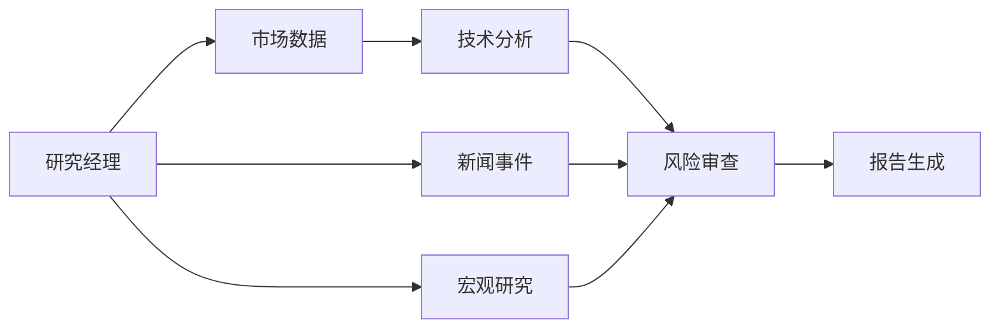

# 架构与实现决策

## 产品范围

系统为本地单用户、A 股/美股日线市场研究系统。前端默认 A 股真实日线，腾讯公共行情无需密钥；模型单独启用。API 省略 market 时保留 US 以兼容旧任务。所有界面、持久化记录、报告都保留数据模式。

固定七角色图：

Manager 制定固定范围的计划；Market 获取标准化日线；Technical 用 Python 计算；News 去重及时间过滤；Macro 解释有限利率背景；Risk 检测跳价、样本不足、动量极端、覆盖缺口及新闻情绪/趋势分歧；Report 汇总并按需进行一次 LLM 综合。

当前图没有自主工具探索、任意循环或自动补充研究。这样可以明确调用范围和费用，后续可添加有上限的复审分支。

## 通信与持久化

- LangGraph `StateGraph` 使用独立状态字段传递各角色输出，避免并发写同一个消息数组。
- `market -> technical` 是依赖链，`[technical, news, macro] -> risk` 为显式汇合屏障。
- `research_jobs` 保存请求、状态、租约、执行次数、调用预算。
- `agent_runs` 以 `(job_id, name)` 为主键保存节点状态、结果和时间。
- `research_events` 保存状态事件；`model_calls` 保存调用预留与成功用量。
- 标准化行情、新闻、宏观与证据快照保存在 JSON 输出内，规模最多 100 条日线/12 条新闻。

**本版本采用应用层持久化节点结果，不是 LangGraph 原生 checkpointer。** 进程恢复后重新进入固定图，包装器读取已完成节点并跳过外部调用，复用同一请求的数据。运行到一半的节点会重新执行；外部服务仍属于至少一次执行，不能承诺网络请求严格只发生一次。模型调用先持久化预留预算，可以限制中断后的重复计费风险。

## 任务生命周期

`queued -> running -> completed | partial | failed | cancelled`

API 创建任务后立即返回 202。Worker 通过条件 UPDATE 原子领取，获得唯一 owner token 和 60 秒租约。每 20 秒续约。节点写入必须满足当前 owner、running 状态和未过期租约，阻止旧 Worker 覆盖新结果。失效租约可被重新领取，最多恢复 3 次。

取消是协作式的：马上变更任务状态并隔离后续结果；已经发往供应商的 HTTP 请求不会被远端撤回，仍可能计费。任务时间预算在节点边界检查，单个在途 HTTP 调用受自身超时控制，不是硬实时进程终止。

本地默认一个嵌入 Worker；Docker 将 API 和 Worker 分离。SQLite 适合本地轻负载，启用 WAL；PostgreSQL 用于部署。数据库中每个节点的输出是本次请求的快照，不实现跨任务共享缓存。

## 失败策略

行情失败：整个任务失败，不编造价格。新闻/宏观 ProviderError：对应节点 partial，保留缺失原因，继续产出受限报告。模型 HTTP、拒绝、输出截断或引用校验失败：不展示其内容，输出规则报告并记录限制。

业务任务不自动重试不可用数据，以避免耗尽 Alpha Vantage 配额。恢复是处理进程中断，不是无限调用上游。模型预算默认 1 次，输出上限默认 2400 tokens；金额是基于用户配置单价的估算。

## 技术取舍

- FastAPI + SQLAlchemy Core，避免为七个角色拆微服务。
- LangGraph 管理执行关系；LangChain Core 仅用于模型提示模板。
- SQLite 默认便于直接运行，PostgreSQL 使用相同仓储接口。
- Redis 暂不引入；任务已持久化于数据库，不需要额外 Broker。
- Next.js App Router / React / TypeScript；无远程字体依赖，图形用 SVG 实现。
- Markdown 由受控模板生成，对外部文本转义；浏览器用 React 文本渲染，不执行原始 HTML。
- 密钥只在环境配置中。异常消息不回显含 API Key 的供应商 URL。

## 后续可扩展项

优先追加交易所标的元数据与交易日历、复权行情、财报/估值 Agent、真实宏观历史版本。再考虑跨任务缓存、多用户鉴权、PDF 导出和规模化执行。当前不把缺失的这些能力包装成已实现功能。

## 核对过的官方资料

- LangGraph 图与汇合：https://docs.langchain.com/oss/python/langgraph/graph-api
- LangGraph 持久化概念：https://docs.langchain.com/oss/python/langgraph/persistence
- FastAPI 后台任务边界：https://fastapi.tiangolo.com/tutorial/background-tasks/
- Alpha Vantage 数据接口：https://www.alphavantage.co/documentation/
- OpenAI 结构化输出：https://developers.openai.com/api/docs/guides/structured-outputs
- Next.js 安装要求：https://nextjs.org/docs/app/getting-started/installation

## 双市场行情

PublicMarketProvider 负责日线：CN 规范化交易所代码；US 从公开报价元数据解析交易所后缀。价格分析仅使用截止日前已收盘日线。A 股未复权、美股前复权（当前修订版本），币种和口径随结果存储；旧报告显示时兼容 USD。上游错误不回退合成数据。新闻/宏观沿用可选美国适配器，A 股明确标注未接入。

接口格式参考 AKShare 腾讯日线适配器：https://github.com/akfamily/akshare/blob/main/akshare/stock_feature/stock_hist_tx.py
